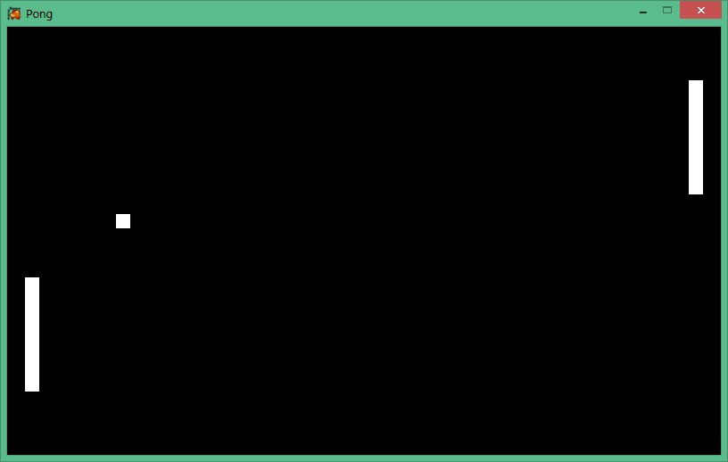

Pong
====

Simple remake of the classic game Pong in XNA/Monogame

TODO:

	-Add sounds
	-Display score
	-Draw middle line
	-Implement pause feature
	-Vary ball angle depending on location of collision with paddles

BUGS:

	-Ball sometimes vibrates when colliding with paddles

Screenshots:

